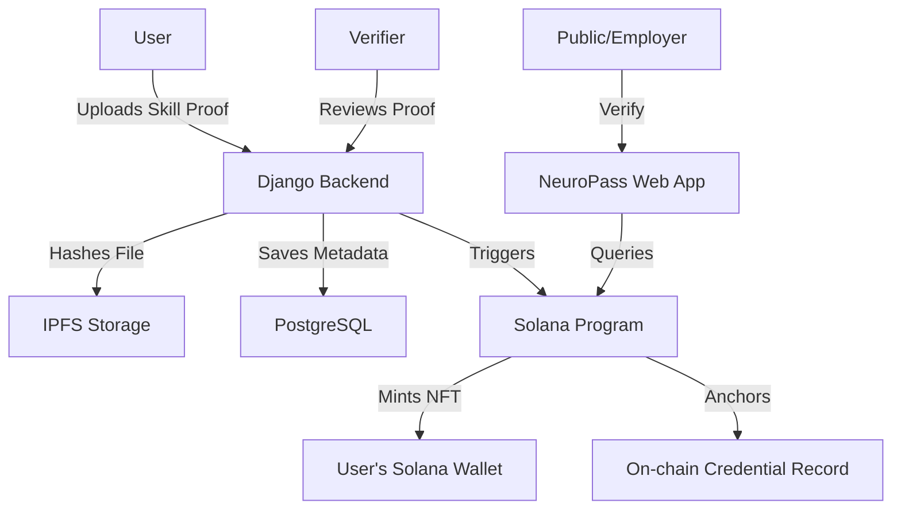

# NeuroPass 🛡️

**From Invisible Talent to Verifiable Opportunity**

NeuroPass is a decentralized skill verification and credentialing platform built on the Solana blockchain. It bridges the trust gap for the informal workforce by allowing users to capture offline skills, get them verified by trusted experts, and anchor those proofs on-chain as verifiable credentials (NFTs).

---

## 🚀 Overview

Across Africa and many developing economies, millions of workers possess high-value skills but lack formal documentation. NeuroPass provides a cryptographic "Passport of Skills" that is:
- **Verifiable:** Powered by Solana's immutable ledger.
- **Trusted:** Verified by vetted experts (mentors, teachers, industry veterans).
- **Accessible:** Bridging the gap between informal talent and global opportunities.

---

## 🛠️ Tech Stack

### Frontend
- **Framework:** React + Vite
- **Styling:** Tailwind CSS
- **3D/Graphics:** Three.js + React Three Fiber
- **Web3:** Solana Wallet Adapter (`@solana/wallet-adapter-react`)

### Backend
- **Framework:** Django + Django REST Framework (DRF)
- **Database:** PostgreSQL
- **Auth:** JWT (Simple JWT)
- **Blockchain Integration:** `solana-py` + `solders`
- **AI (Phase 2):** Google GenAI (Gemini) / OpenAI

### Blockchain (Smart Contracts)
- **Framework:** Anchor (Rust)
- **Network:** Solana Devnet / Localnet
- **Program Logic:** Manages a global registry, verifier records, skill submissions, and credential anchoring.

### Storage
- **IPFS:** Decentralized storage for proof assets (video/images) and NFT metadata via Pinata.

---

## 🏗️ Architecture



---

## 📂 Project Structure

- `frontend/`: The React web application.
- `backend/`: The Django REST API and blockchain orchestration layer.
- `neuro_pass/`: The Solana Anchor program (smart contracts) and deployment scripts.
- `PRD.md`: Product Requirements Document.
- `DEPLOYMENT_GUIDE.md`: Instructions for deploying to production.

---

## 🚦 Getting Started

### 1. Smart Contract (Anchor)
Navigate to the `neuro_pass` directory:
```bash
cd neuro_pass
yarn install
anchor build
```
To run local tests and spin up a validator:
```bash
./scripts/run_local.sh
```

### 2. Backend (Django)
Navigate to the `backend` directory:
```bash
cd backend
python -m venv .venv
source .venv/bin/activate
pip install -r requirements.txt
python manage.py migrate
python manage.py runserver
```
*Note: Ensure you have a `.env` file configured with your Solana wallet keys and Pinata credentials.*

### 3. Frontend (React)
Navigate to the `frontend` directory:
```bash
cd frontend
npm install
npm run dev
```

---

## 🛡️ Key Features

- **Hybrid Identity:** Secure email/password login linked to a Phantom/Solana wallet.
- **Proof Hashing:** Every skill submission generates a SHA-256 hash, ensuring the proof file cannot be altered.
- **On-chain Registry:** A global registry tracks trusted verifiers and their reputation.
- **NFT Credentials:** Verified skills are minted as NFTs on Solana, making them easily shareable and verifiable on any block explorer.
- **Public Verification Portal:** Anyone can verify a user's skill by querying the on-chain record using the NFT's mint address.

---

## 🗺️ Roadmap

- [x] **Phase 1 (MVP):** End-to-end skill submission, verification, and NFT minting.
- [x] **Phase 2 (AI & Reputation):**
    - AI-assisted skill tagging and level suggestion (Gemini integration).
    - Verifier reputation scoring system.
    - Integration with opportunity platforms (e.g., Frontier Pass).
- [ ] **Phase 3 (Mobile & PWA):** Mobile-first capture of skills in low-connectivity environments.

---

## 📄 License

This project is licensed under the MIT License - see the LICENSE file for details.

---

**NeuroPass** — *From Invisible Talent to Verifiable Opportunity.*
Built for the **OnchainED 1.0 Hackathon**.
